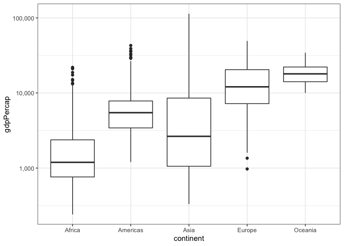
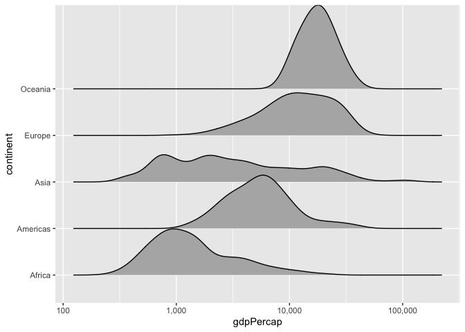
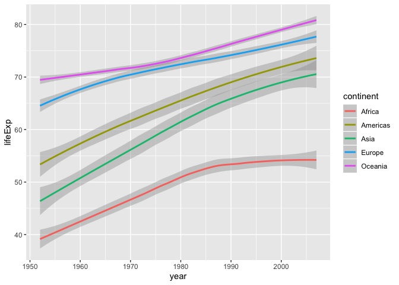

Assignment\_3
================

``` r
library(gapminder)
library(tidyverse)
library(ggridges)
library(scales)
```

# Task 2: Maximum and Minimum GDP per Capita by Continent

Below is a table of the minimum and maxumum GDP per capita for each
continent (taken from any country in any year). The boxplot below also
tells you the range of GDP per capita for each continent and is easier
to understand. Oceania’s max and min are close to each other, while
Asia’s max and min are far apart. The Americas and Europe have a
similar range.

``` r
gapminder %>%
  group_by(continent) %>%
  summarize(max_gdp = max(gdpPercap), min_gdp = min(gdpPercap)) %>%
  knitr::kable()
```

| continent |  max\_gdp |   min\_gdp |
| :-------- | --------: | ---------: |
| Africa    |  21951.21 |   241.1659 |
| Americas  |  42951.65 |  1201.6372 |
| Asia      | 113523.13 |   331.0000 |
| Europe    |  49357.19 |   973.5332 |
| Oceania   |  34435.37 | 10039.5956 |

``` r
gapminder %>%
  ggplot(aes(y = gdpPercap, x = continent)) +
  geom_boxplot() +
  scale_y_log10(labels = comma_format()) +
  theme_bw()
```

<!-- -->

# Task 3: Spread of GDP per Capita within Continents

The table shows the quantiles of GDP per capita for each continent. The
code for calculating quantiles within the dplyr pipe is modified from
[here](https://stackoverflow.com/questions/30488389/using-dplyr-window-functions-to-calculate-percentiles).
It’s not easy to interpret the spread from these numbers. It’s much
easier to see the spread from the ridge plot below. The GDP per capita
of Asian countries are very spread out. GDP per capita in African
countries is skewed to the lower end of its range. The American
countries have a middling gaussian distribution, while Oceania has a
gaussian distributions on the higher end.

``` r
gapminder %>%
  group_by(continent) %>%
  summarise(gdpPercap = list(enframe(quantile(gdpPercap, probs=c(0,0.25,0.5,0.75, 1))))) %>%
  unnest(cols = c(gdpPercap)) %>%
  pivot_wider(names_from = name, values_from = value) %>%
  knitr::kable()
```

| continent |         0% |       25% |       50% |       75% |      100% |
| :-------- | ---------: | --------: | --------: | --------: | --------: |
| Africa    |   241.1659 |   761.247 |  1192.138 |  2377.417 |  21951.21 |
| Americas  |  1201.6372 |  3427.779 |  5465.510 |  7830.210 |  42951.65 |
| Asia      |   331.0000 |  1056.993 |  2646.787 |  8549.256 | 113523.13 |
| Europe    |   973.5332 |  7213.085 | 12081.749 | 20461.386 |  49357.19 |
| Oceania   | 10039.5956 | 14141.859 | 17983.304 | 22214.117 |  34435.37 |

``` r
gapminder %>%
  group_by(continent) %>%
  ggplot(aes(gdpPercap, continent)) +
  geom_density_ridges() +
  scale_x_log10(labels = comma_format())
```

    ## Picking joint bandwidth of 0.0962

<!-- -->

# Task 5: Change in Life Expectancy over Time by Continent

The table below shows the mean increase in life expectancy from 1952 to
2007 for each continent. The table is pretty easy to understand (Oceania
increased the least and Asia increased the most), but it doen’t tell us
where the continents’ mean life expectancy started and ended compared to
each other. The smoothed line plot shows the overall increase, but gives
you more information about interannual variability in life expectancy.
It also shows you that, though mean life expectancy in Oceania increased
the least, it has the highest life expectancy of all the continents each
year. Though Asia saw the largest increase in mean life expectancy, it
still hadn’t surpassed that of the Americas by 2007. Notably, Africa saw
a rate of increase in mean life expectancy similar to that of the other
continents until the late 80s, when it plateaued.

``` r
gapminder %>%
  group_by(continent, year) %>%
  summarise(mean = mean(lifeExp)) %>%
  ungroup() %>%
  group_by(continent) %>%
  summarise(delta_lifeExp = last(mean) - first(mean)) %>%
  knitr::kable()
```

| continent | delta\_lifeExp |
| :-------- | -------------: |
| Africa    |       15.67054 |
| Americas  |       20.32828 |
| Asia      |       24.41409 |
| Europe    |       13.24010 |
| Oceania   |       11.46450 |

``` r
gapminder %>%
  ggplot(aes(x = year, y = lifeExp, color = continent)) +
  geom_smooth()
```

    ## `geom_smooth()` using method = 'loess' and formula 'y ~ x'

<!-- -->

# Cheat Sheet Comments

All of these are pretty easy to make because tidyverse is so intuitive.
However, comparing the outputs of Task 2 and Task 3, I find the ridge
plot the easiest way to compare the min/max/range/spread of the
continents (better than tables, quantiles, and boxplots). I like density
plots because they’re super easy to make and give you the most complete
idea of what the data is doing. I might be biased, though, since I use
probability density functions a lot in my own research.
